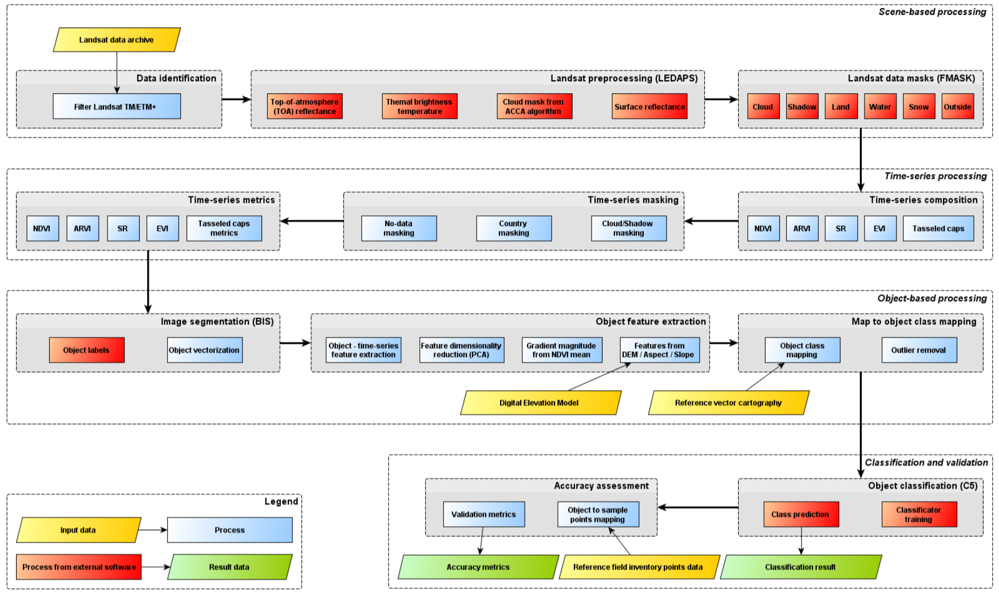

#MAD-Mex's system theory

##Land cover

There are important concepts such as land cover, which refers to the morphology of the surface and describes the physical material of the Earth also considering human activity, thus defining closely cover classes with their physical characteristics. Classes are relatively easy to discern by measurements of remote sensors, which record the spectral response of the different types of surfaces. Examples of land cover classes are; forest, water bodies and bare soils, which are also commonly subdivided, e.g. in coniferous forest and broadleaf or deciduous or evergreen. 

##Land cover clasifiation

The classification system of land cover ([LCCS](http://www.fao.org/docrep/003/x0596e/x0596e00.HTM)) was developed by the Food and Agriculture Organization (FAO) of the United Nations. It is an effort of description of soil cover classes in a standardized manner which is divided into two phases: dichotomous and hierarchical-modular. The system facilitates the interpretation of the legend and harmonization of cartography.
Classification is an abstract representation of the real situation in the field using well defined diagnostic criteria called classifiers. They are defined by Sokal (1974), as "the arrangement or ordering of objects in groups or sets on the basis of their relations." A classification describes the systematic scheme with the names of the classes and the criteria used to distinguish them, and the relationship between classes. So the classification requires the definition of class boundaries, which must be clear, precise, if possible quantitative, and based on objective criteria.

##Change detection  in land cover classification 

Change detection is to identify differences in the state of a feature or phenomenon by observations made at different times. Detecting changes in the MADMex system is based on the bitemporal comparison of images, for both reference periods in processing Landsat and for the annual processing of RapidEye. Bitemporal detecting changes is performed by the algorithm iMAD (Multivariate Alteration Detection transformation) and post-processing algorithm based on the MAF (Autocorrelation Factor Maximum transformation).

## Workflow classification process (LANDSAT)

##MAD Transform

##MAF Transform

## Fmask algorithm

